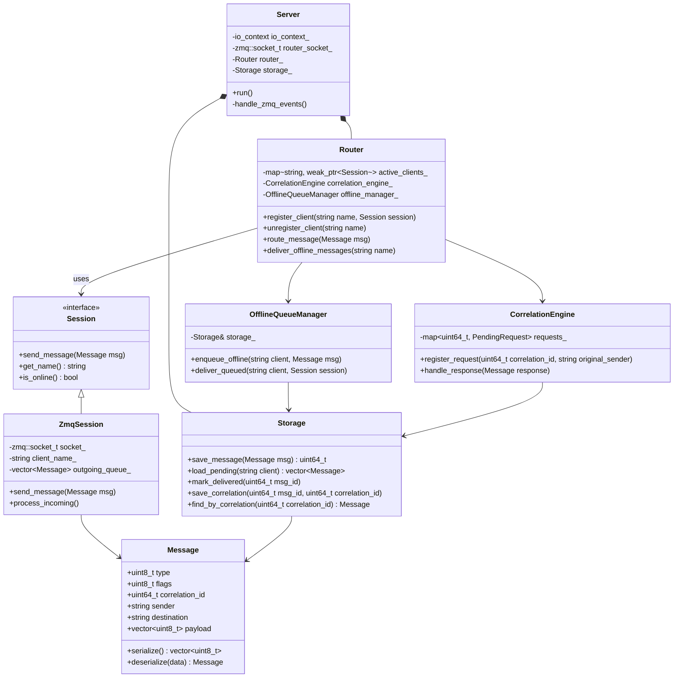
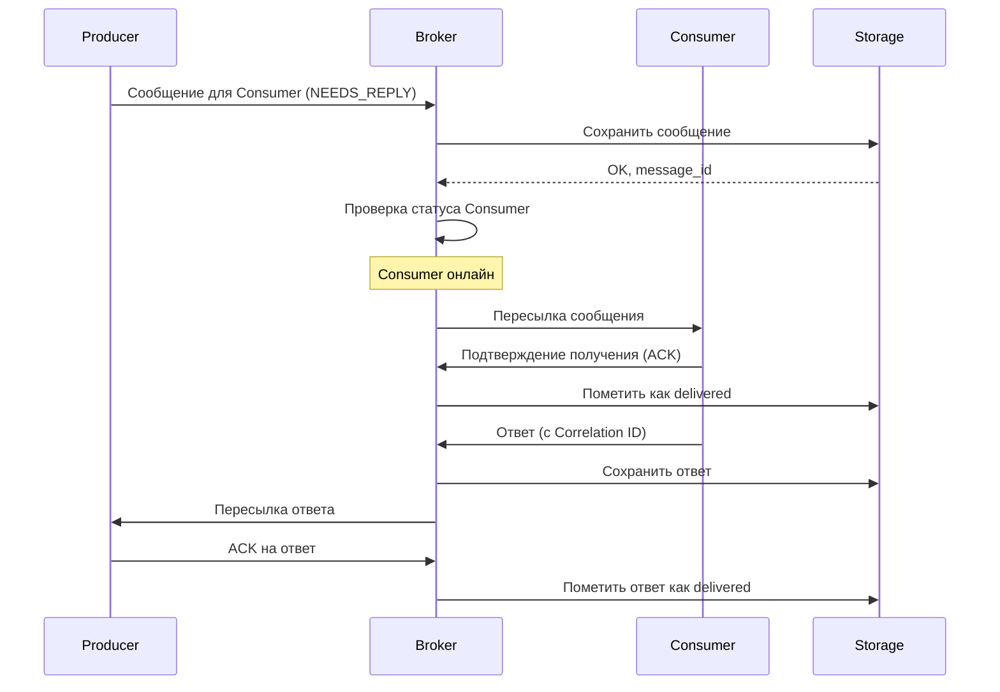
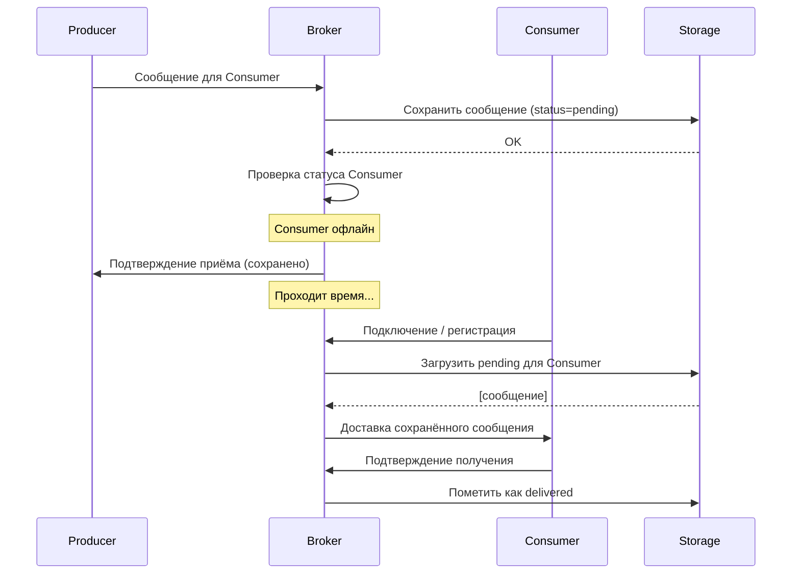
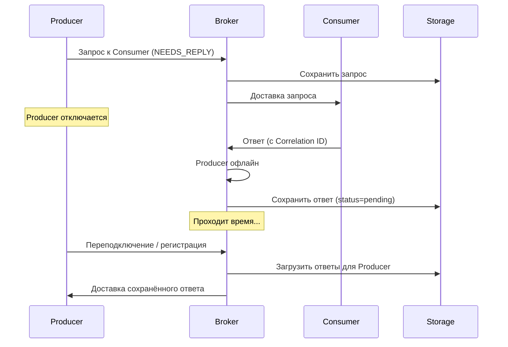

[](https://isocpp.org/)
[](https://www.boost.org/)
[](https://zeromq.org/)
[](https://www.sqlite.org/)

Асинхронный брокер сообщений с гарантированной доставкой, поддержкой двухсторонней связи (request-reply) и персистентным хранением на диске. Реализован на C++ с использованием библиотек Boost.Asio и ZeroMQ.

## 📋 Содержание

- [О проекте](#о-проекте)
- [Функциональные возможности](#функциональные-возможности)
- [Архитектура](#архитектура)
- [Диаграмма классов](#диаграмма-классов)
- [Сценарии работы](#сценарии-работы)
- [Технологический стек](#технологический-стек)
- [Структура проекта](#структура проекта)
- [Сборка и установка](#сборка-и-установка)

### Ключевые особенности:

- **Гарантированная доставка** — все сообщения сохраняются на диск и не теряются при отключении клиентов или самого брокера
- **Двухсторонняя связь** — поддержка паттерна request-reply с корреляцией сообщений
- **Отложенная доставка** — сообщения для офлайн-получателей хранятся и доставляются при их подключении
- **Асинхронность** — неблокирующая обработка всех операций
- **Масштабируемость** — пул потоков для обработки множества одновременных соединений

## ✨ Функциональные возможности

### Для клиентов

| Возможность | Описание |
|-------------|----------|
| **Регистрация** | Клиент подключается к брокеру и регистрируется под уникальным логическим именем |
| **Отправка сообщений** | Отправка сообщения любому зарегистрированному клиенту по имени |
| **Запрос-ответ** | Отправка сообщения с требованием ответа (флаг `NEEDS_REPLY`) |
| **Получение ответов** | Автоматическая маршрутизация ответов исходному отправителю |
| **Офлайн-режим** | Получение сообщений, отправленных во время отсутствия, при повторном подключении |

### Для брокера

| Возможность | Описание |
|-------------|----------|
| **Маршрутизация** | Доставка сообщений по логическим именам получателей |
| **Персистентность** | Сохранение всех сообщений в SQLite до подтверждения доставки |
| **Корреляция** | Связывание запросов и ответов через Correlation ID |
| **Управление сессиями** | Отслеживание подключённых клиентов и их статуса |
| **Восстановление** | Загрузка неотправленных сообщений при запуске |

## 🏗 Архитектура
### Контекст системы


### Контейнеры


### Основные компоненты


## 📊 Диаграмма классов


## 🔄 Сценарии работы

### Сценарий 1: Отправка сообщения онлайн-получателю


### Сценарий 2: Отправка сообщения офлайн-получателю


### Сценарий 3: Запрос-ответ с офлайн-отправителем

### Интеграция ZeroMQ и Boost.Asio
Для объединения двух библиотек в единый цикл событий используется следующий подход:

ZeroMQ сокеты работают в неблокирующем режиме

В основном потоке используется zmq_poll с небольшим таймаутом

После каждого опроса все готовые дескрипторы обрабатываются, а управление передаётся io_context::poll() или io_context::run_for()

Альтернативно на Unix-системах можно получить файловый дескриптор сокета ZeroMQ через getsockopt(ZMQ_FD) и использовать boost::asio::posix::stream_descriptor для полноценной асинхронной интеграции.

## 🛠 Технологический стек

| Компонент | Технология |
|-----------|------------|
| **Язык** | C++17/20 |
| **Сеть** | Boost.Asio |
| **Транспорт** | ZeroMQ (libzmq + cppzmq) |
| **Хранение** | SQLite |
| **Логирование** | spdlog |
| **Сборка** | CMake |
| **Тестирование** | Google Test |

### Язык программирования: C++17/20
**Обоснование:**
- Требуется максимальная производительность, низкоуровневый контроль над ресурсами и богатая экосистема библиотек.
- C++ обеспечивает эффективную работу с сетью, памятью и многопоточностью, что критически важно для брокера сообщений.

### Сетевая библиотека: Boost.Asio
**Обоснование:**
- Стандарт де-факто для асинхронного сетевого программирования на C++
- Асинхронная модель (Proactor) идеально подходит для высоконагруженных I/O-приложений
- Богатые возможности (таймеры, сигналы, интеграция с другими библиотеками)
- Часть Boost (широко используется, хорошая документация)
- Кроссплатформенность
- Единый цикл событий (io_context) для всех асинхронных операций

### Транспорт и маршрутизация: ZeroMQ (libzmq + cppzmq)
**Обоснование:**
- Готовые паттерны ROUTER/DEALER для асинхронной маршрутизации
- Автоматическое управление соединениями и переподключением
- Фреймовая структура сообщений (удобно для заголовков и метаданных)
- Высокая производительность (ядро на C)
- Проверенная временем библиотека, используемая в высоконагруженных системах

### Хранение данных: SQLite
**Обоснование:**
- Встраиваемая БД (не требует отдельного сервиса)
- Транзакционность (гарантия целостности при записи на диск)
- SQL для удобной выборки (pending сообщения для клиента, поиск по корреляции)
- Достаточная производительность для заявленных нагрузок
- Надёжность (атомарная запись на диск)
- Минимальные накладные расходы

### Логирование: spdlog
Обоснование:

Высокая производительность (асинхронные режимы)

Простой и удобный API

Гибкое форматирование

Поддержка ротации файлов

### Сборка: CMake
Обоснование:

Стандарт для C++ проектов

Удобное управление зависимостями (FetchContent, find_package)

Кроссплатформенность

Хорошая интеграция с IDE

### Тестирование: Google Test
Обоснование: Фреймворк обеспечивает удобное модульное и интеграционное тестирование ключевых компонентов (маршрутизация, корреляция, хранение).

## Структура проекта
```
broker/
├── cmake/                 # CMake модули
├── include/               
│   └── broker/            # Публичные заголовки
│       ├── server.hpp
│       ├── router.hpp
│       ├── message.hpp
│       └── storage.hpp
├── src/
│   ├── server.cpp
│   ├── router.cpp
│   ├── message.cpp
│   ├── storage.cpp
│   ├── zmq_gateway.cpp
│   └── main.cpp
├── libs/                   # Внешние зависимости (через CMake)
├── tests/
│   ├── unit/
│   └── integration/
├── examples/               # Примеры клиентов
│   ├── cpp_client/
│   └── python_client/
├── docs/                   # Документация
├── CMakeLists.txt
└── README.md
```

## Сборка и установка

### Требования

- CMake 3.15+
- Компилятор с поддержкой C++17 (GCC 9+)
- Boost 1.82+ (Asio, Beast)
- ZeroMQ 4.3+ (libzmq, cppzmq)
- SQLite3
- spdlog


