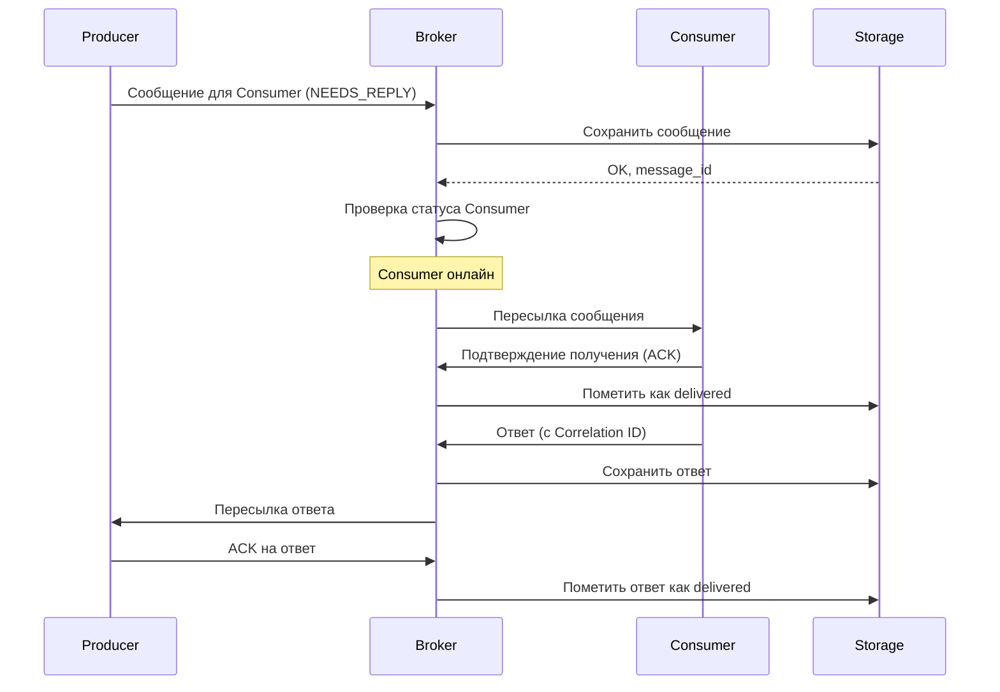
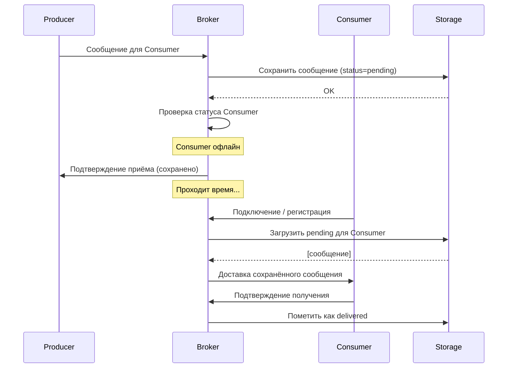
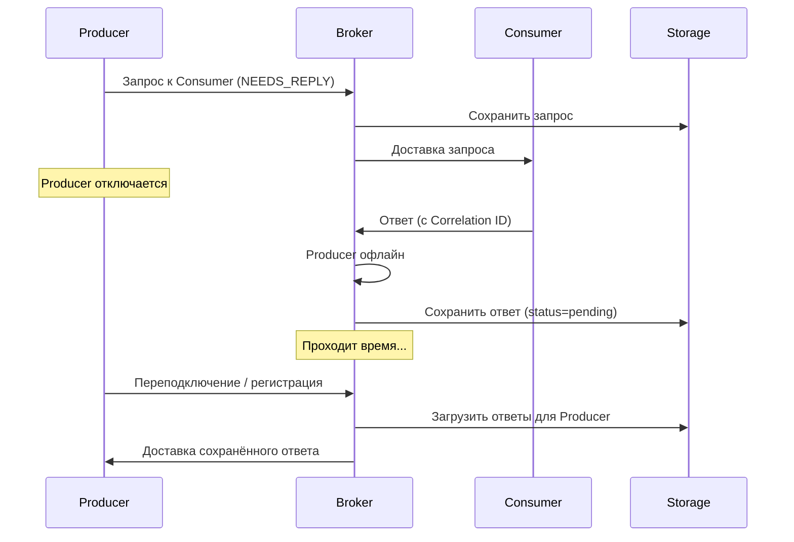

[](https://isocpp.org/)
[](https://www.boost.org/)
[](https://zeromq.org/)
[](https://www.sqlite.org/)

Асинхронный брокер сообщений с гарантированной доставкой, поддержкой двухсторонней связи (request-reply) и персистентным хранением на диске. Реализован на C++ с использованием библиотек Boost.Asio и ZeroMQ.

## 📋 Техническое задание (сводка)

### Ключевые требования к проекту

| Категория | Требование |
|-----------|------------|
| **Архитектура** | Отдельный процесс (не библиотека) |
| **Транспорт** | ZeroMQ (ROUTER/DEALER) |
| **Сеть** | Boost.Asio (асинхронный I/O) |
| **Хранение** | SQLite (персистентность) |
| **Регистрация** | По логическим именам |
| **Маршрутизация** | По имени получателя |
| **Доставка** | Гарантированная (сохранение на диск) |
| **Офлайн-режим** | Отложенная доставка |
| **Двухсторонняя связь** | Request-reply с корреляцией |
| **Подтверждения** | Application-level ACK |
| **Протокол** | Бинарный (TLV) |
| **Клиенты** | C++ примеры |
| **Тестирование** | Google Test |
| **Сборка** | CMake |

[📄 Полный текст технического задания](docs/technical-specification.md)

### Ключевые особенности:

- **Гарантированная доставка** — все сообщения сохраняются на диск и не теряются при отключении клиентов или самого брокера
- **Двухсторонняя связь** — поддержка паттерна request-reply с корреляцией сообщений
- **Отложенная доставка** — сообщения для офлайн-получателей хранятся и доставляются при их подключении
- **Асинхронность** — неблокирующая обработка всех операций
- **Масштабируемость** — пул потоков для обработки множества одновременных соединений

## ✨ Функциональные возможности

### Для клиентов

| Возможность | Описание |
|-------------|----------|
| **Регистрация** | Клиент подключается к брокеру и регистрируется под уникальным логическим именем |
| **Отправка сообщений** | Отправка сообщения любому зарегистрированному клиенту по имени |
| **Запрос-ответ** | Отправка сообщения с требованием ответа (флаг `NEEDS_REPLY`) |
| **Получение ответов** | Автоматическая маршрутизация ответов исходному отправителю |
| **Офлайн-режим** | Получение сообщений, отправленных во время отсутствия, при повторном подключении |

### Для брокера

| Возможность | Описание |
|-------------|----------|
| **Маршрутизация** | Доставка сообщений по логическим именам получателей |
| **Персистентность** | Сохранение всех сообщений в SQLite до подтверждения доставки |
| **Корреляция** | Связывание запросов и ответов через Correlation ID |
| **Управление сессиями** | Отслеживание подключённых клиентов и их статуса |
| **Восстановление** | Загрузка неотправленных сообщений при запуске |

## 🏗 Архитектура
### Контекст системы


### Контейнеры


### Основные компоненты


## 📊 Диаграмма классов

```mermaid
classDiagram
    %% ========== ИНТЕРФЕЙСЫ ==========
    class IStorage {
        <<interface>>
        +SaveMessage(Message) uint64_t
        +MarkDelivered(uint64_t)
        +MarkSent(uint64_t)
        +NeedsAck(uint64_t) bool
        +MarkPending(uint64_t)
        +SaveCorrelation(uint64_t, uint64_t, string)
        +FindOriginalSenderByCorrelation(uint64_t) string
        +FindMessageIdByCorrelation(uint64_t) uint64_t
        +FindMessageIdByCorrelationAndDestination(uint64_t, string) uint64_t
        +MarkAckReceived(uint64_t, string)
        +LoadExpiredSent(int) vector~PendingMessage~
        +LoadPendingRepliesForSenderOnly(string) vector~PendingMessage~
        +LoadPendingMessagesOnly(string) vector~PendingMessage~
    }
    
    class IMessageSender {
        <<interface>>
        +SendToClient(zmq::message_t, zmq::message_t, callback)
    }
    
    class IConfigProvider {
        <<interface>>
        +GetConfig() Config
    }
    
    class ISessionManager {
        <<interface>>
        +FindSession(string) shared_ptr~Session~
        +RegisterClient(string, shared_ptr~Session~) bool
        +UnregisterClient(string)
        +PrintActiveClients()
        +CleanupInactiveSessions()
        +DeliverOfflineMessages(string)
        +DeliverPendingReplies(string)
        +PersistMessageForClient(string, Message)
        +CheckExpiredAcks()
    }
    
    class IMetrics {
        <<interface>>
        +IncrementMessagesReceived()
        +IncrementMessagesSent()
        +IncrementMessagesFailed()
        +IncrementAcksReceived()
        +IncrementMessagesExpired()
        +IncrementOfflineDelivered()
        +IncrementClientsRegistered()
        +IncrementClientsUnregistered()
        +IncrementClientsTimeout()
        +SetActiveSessions(int)
        +SetPendingSendQueueSize(size_t)
        +ObservePayloadSize(size_t)
        +AddMessageProcessingTime(double)
    }
    
    class IMessageHandler {
        <<interface>>
        +Handle(Message, HandlerContext)
    }
    
    %% ========== СТРУКТУРЫ ==========
    class Config {
        +int Port
        +string DbPath
        +int Threads
        +string LogLevel
        +int SessionTimeout
        +int AckTimeout
        +bool EnableMetrics
        +string MetricsBindAddress
        +int MetricsUpdateInterval
        +ParseArgs() Config$
        +PrintHelp()$
    }
    
    class PendingMessage {
        +uint64_t id
        +Message msg
    }
    
    class HandlerContext {
        +IStorage& storage
        +ISessionManager& session_manager
        +IMessageSender& message_sender
        +IConfigProvider& config_provider
        +zmq::message_t& identity
        +shared_ptr~IMetrics~ metrics
    }
    
    %% ========== ОСНОВНЫЕ КЛАССЫ ==========
    class Server {
        -Config config_
        -zmq::socket_t router_socket_
        -io_context io_context_
        -unique_ptr~Router~ router_
        -unique_ptr~Storage~ storage_
        -shared_ptr~MetricsManager~ metrics_manager_
        +Server(Config)
        +Run()
        +Stop()
        +SendToClient(zmq::message_t, zmq::message_t, callback)
        +GetConfig() Config
        +GetMetrics() shared_ptr~IMetrics~
    }
    
    class Router {
        -IStorage& storage_
        -IMessageSender& message_sender_
        -IConfigProvider& config_provider_
        -shared_ptr~IMetrics~ metrics_
        -unordered_map~string, shared_ptr~Session~~ active_clients_
        -mutex registry_mutex_
        +Router(IStorage&, IMessageSender&, IConfigProvider&, shared_ptr~IMetrics~)
        +RouteMessage(Message, zmq::message_t&)
        +FindSession(string) shared_ptr~Session~
        +RegisterClient(string, shared_ptr~Session~) bool
        +UnregisterClient(string)
        +PrintActiveClients()
        +CleanupInactiveSessions()
        +DeliverOfflineMessages(string)
        +DeliverPendingReplies(string)
        +PersistMessageForClient(string, Message)
        +CheckExpiredAcks()
    }
    
    class Storage {
        -sqlite3* db_
        -string db_path_
        -mutex db_mutex_
        +Storage(string)
        +~Storage()
        +SaveMessage(Message) uint64_t
        +MarkDelivered(uint64_t)
        +MarkSent(uint64_t)
        +NeedsAck(uint64_t) bool
        +MarkPending(uint64_t)
        +SaveCorrelation(uint64_t, uint64_t, string)
        +FindOriginalSenderByCorrelation(uint64_t) string
        +FindMessageIdByCorrelation(uint64_t) uint64_t
        +FindMessageIdByCorrelationAndDestination(uint64_t, string) uint64_t
        +MarkAckReceived(uint64_t, string)
        +LoadExpiredSent(int) vector~PendingMessage~
        +LoadPendingRepliesForSenderOnly(string) vector~PendingMessage~
        +LoadPendingMessagesOnly(string) vector~PendingMessage~
    }
    
    class Session {
        -zmq::message_t identity_
        -IMessageSender& message_sender_
        -string name_
        -bool is_online_
        -queue~Message~ outgoing_queue_
        -mutex queue_mutex_
        -time_point last_receive_
        -time_point last_activity_
        +Session(zmq::message_t, IMessageSender&, Config&)
        +~Session()
        +SendMessage(Message) bool
        +GetName() string
        +IsOnline() bool
        +GetIdentity() zmq::message_t&
        +SetName(string)
        +FlushQueue()
        +MarkOffline()
        +MarkOnline()
        +UpdateLastReceive()
        +UpdateLastActivity()
        +IsExpired(int) bool
        +PersistQueueToDatabase()
        +GetQueueSize() size_t
    }
    
    class Message {
        -MessageType type_
        -uint8_t flags_
        -uint64_t correlation_id_
        -string sender_
        -string destination_
        -vector~uint8_t~ payload_
        +Message()
        +Message(MessageType, uint8_t, uint64_t, string, string, vector~uint8_t~)
        +GetType() MessageType
        +GetFlags() uint8_t
        +GetCorrelationId() uint64_t
        +GetSender() string
        +GetDestination() string
        +GetPayload() vector~uint8_t~
        +SetType(MessageType)
        +SetFlags(uint8_t)
        +SetCorrelationId(uint64_t)
        +SetSender(string)
        +SetDestination(string)
        +SetPayload(vector~uint8_t~)
        +NeedsReply() bool
        +NeedsAck() bool
        +Serialize() vector~uint8_t~
        +Deserialize(vector~uint8_t~)$ Message
        +ToString() string
    }
    
    class MetricsManager {
        -atomic~uint64_t~ messages_received_
        -atomic~uint64_t~ messages_sent_
        -unique_ptr~Exposer~ exposer_
        +MetricsManager()
        +InitExposer(string)
        +StartUpdater(seconds)
        +StopUpdater()
        +IncrementMessagesReceived()
        +IncrementMessagesSent()
        +IncrementMessagesFailed()
        +IncrementAcksReceived()
        +IncrementMessagesExpired()
        +IncrementOfflineDelivered()
        +IncrementClientsRegistered()
        +IncrementClientsUnregistered()
        +IncrementClientsTimeout()
        +SetActiveSessions(int)
        +SetPendingSendQueueSize(size_t)
        +ObservePayloadSize(size_t)
        +AddMessageProcessingTime(double)
    }
    
    %% ========== ОБРАБОТЧИКИ ==========
    class RegisterHandler {
        +Handle(Message, HandlerContext)
    }
    
    class MessageHandler {
        +Handle(Message, HandlerContext)
    }
    
    class ReplyHandler {
        +Handle(Message, HandlerContext)
    }
    
    class AckHandler {
        +Handle(Message, HandlerContext)
    }
    
    class UnregisterHandler {
        +Handle(Message, HandlerContext)
    }
    
    class MessageHandlerFactory {
        <<static>>
        +Create(MessageType) unique_ptr~IMessageHandler~
    }
    
    %% ========== ПЕРЕЧИСЛЕНИЯ ==========
    class MessageType {
        <<enumeration>>
        Register = 1
        Message = 2
        Reply = 3
        Ack = 4
        Unregister = 5
    }
    
    class MessageFlag {
        <<enumeration>>
        FlagNone = 0
        FlagNeedsReply = 1
        FlagNeedsAck = 2
    }
    
    class MessageStatus {
        <<enumeration>>
        STATUS_PENDING = 0
        STATUS_DELIVERED = 1
        STATUS_SENT = 2
    }
    
    %% ========== ОТНОШЕНИЯ ==========
    Server ..|> IMessageSender
    Server ..|> IConfigProvider
    Server *-- Router
    Server *-- Storage
    Server *-- MetricsManager
    
    Storage ..|> IStorage
    Storage --> PendingMessage
    Storage --> Message
    
    Router ..|> ISessionManager
    Router --> IStorage
    Router --> IMessageSender
    Router --> IConfigProvider
    Router --> IMetrics
    Router *-- Session
    
    Session --> IMessageSender
    Session --> Config
    Session --> Message
    
    MetricsManager ..|> IMetrics
    
    IMessageHandler <|.. RegisterHandler
    IMessageHandler <|.. MessageHandler
    IMessageHandler <|.. ReplyHandler
    IMessageHandler <|.. AckHandler
    IMessageHandler <|.. UnregisterHandler
    
    MessageHandlerFactory --> IMessageHandler
    MessageHandlerFactory ..> MessageType
    
    HandlerContext --> IStorage
    HandlerContext --> ISessionManager
    HandlerContext --> IMessageSender
    HandlerContext --> IConfigProvider
    HandlerContext --> IMetrics
    
    Message --> MessageType
    Message --> MessageFlag
    Storage --> MessageStatus
```


## 🔄 Сценарии работы

### Сценарий 1: Отправка сообщения онлайн-получателю


### Сценарий 2: Отправка сообщения офлайн-получателю


### Сценарий 3: Запрос-ответ с офлайн-отправителем

### Интеграция ZeroMQ и Boost.Asio
Для объединения двух асинхронных библиотек в единый цикл событий используется следующий подход:

1. **Неблокирующий режим ZeroMQ**
   - ZMQ сокет переводится в неблокирующий режим
     
2. **Интеграция через файловый дескриптор (FD)**
   - ZMQ сокет предоставляет файловый дескриптор
   - Дескриптор оборачивается в `boost::asio::posix::stream_descriptor`
   - Асинхронное ожидание событий

3. **Цикл обработки событий**
   - При срабатывании триггера `ZMQ_POLLIN` вызывается колбэк
   - В колбэке сообщения вычитываются в цикле до тех пор, пока сокет не опустеет

4. **Многопоточная обработка**
   - Используется пул потоков, каждый из которых вызывает `io_context_.run()`
   - Все асинхронные операции (ZMQ, таймеры, callback'и) выполняются в контексте этих потоков
   - Синхронизация доступа к разделяемым данным осуществляется через мьютексы

## 🛠 Технологический стек

| Компонент | Технология |
|-----------|------------|
| **Язык** | C++17 |
| **Сеть** | Boost.Asio |
| **Транспорт** | ZeroMQ (libzmq + cppzmq) |
| **Хранение** | SQLite |
| **Логирование** | spdlog |
| **Сборка** | CMake |
| **Тестирование** | Google Test |

### Язык программирования: C++17
**Обоснование:**
- Требуется максимальная производительность
- C++ обеспечивает эффективную работу с сетью, памятью и многопоточностью, что критически важно для брокера сообщений.

### Сетевая библиотека: Boost.Asio
**Обоснование:**
- Стандарт де-факто для асинхронного сетевого программирования на C++
- Асинхронная модель (Proactor) идеально подходит для высоконагруженных I/O-приложений
- Кроссплатформенность
- Единый цикл событий (io_context) для всех асинхронных операций

### Транспорт и маршрутизация: ZeroMQ (libzmq + cppzmq)
**Обоснование:**
- Готовые паттерны ROUTER/DEALER для асинхронной маршрутизации
- Автоматическое управление соединениями и переподключением
- Фреймовая структура сообщений (удобно для заголовков и метаданных)
- Высокая производительность (ядро на C)

### Хранение данных: SQLite
**Обоснование:**
- Встраиваемая БД (не требует отдельного сервиса)
- Транзакционность (гарантия целостности при записи на диск)
- SQL для удобной выборки (поиск по корреляции)
- Надёжность (атомарная запись на диск)
- Минимальные накладные расходы

### Логирование: spdlog
**Обоснование:**
- Высокая производительность (асинхронные режимы)
- Простой и удобный API
- Гибкое форматирование

### Сборка: CMake
**Обоснование:**
- Стандарт для C++ проектов
- Удобное управление зависимостями (FetchContent, find_package)
- Кроссплатформенность

### Тестирование: Google Test
**Обоснование:**
- Фреймворк обеспечивает удобное тестирование ключевых компонентов (маршрутизация, корреляция, хранение).

## Структура проекта
```
async-message-broker/
│
├── CMakeLists.txt                    # Корневой CMake (подключает src/ и tests/)
│
├── README.md                         # Документация проекта
│
├── docs/
│   ├── api-documentation.md          # Документация API
│   └── technical-specification.md    # Техническое задание (упоминается в README)
│
├── include/
│   └── broker/
│       ├── config.hpp                # Конфигурация сервера
│       ├── interfaces.hpp            # Все интерфейсы (IStorage, ISessionManager и др.)
│       ├── message.hpp               # Класс Message и enums
│       ├── message_handler.hpp       # Обработчики сообщений + HandlerContext
│       ├── metrics.hpp               # IMetrics, MetricsManager, ScopedMetricsTimer
│       ├── router.hpp                # Класс Router (реализует ISessionManager)
│       ├── server.hpp                # Класс Server
│       ├── session.hpp               # Класс Session
│       └── storage.hpp               # Класс Storage (реализует IStorage)
│
├── src/
│   ├── CMakeLists.txt                # Сборка исходников
│   ├── main.cpp                      # Точка входа (парсинг аргументов, запуск Server)
│   ├── server.cpp                    # Реализация Server
│   ├── router.cpp                    # Реализация Router
│   ├── session.cpp                   # Реализация Session
│   ├── storage.cpp                   # Реализация Storage (SQLite)
│   ├── message.cpp                   # Реализация Message (сериализация)
│   ├── message_handler.cpp           # Реализация всех обработчиков + Factory
│   ├── metrics.cpp                   # Реализация MetricsManager (если включены метрики)
│   └── metrics_stub.cpp              # Заглушка метрик (если выключены)
│
├── examples/
│   ├── CMakeLists.txt                # Сборка примеров (опционально)
│   └── universal_client.cpp          # Универсальный клиент (интерактивный)
│
├── tests/
    ├── CMakeLists.txt                # Сборка тестов
    ├── mock/
    │   ├── mock_storage.hpp          # Mock для IStorage
    │   ├── mock_message_sender.hpp   # Mock для IMessageSender
    │   └── mock_config_provider.hpp  # Mock для IConfigProvider
    ├── test_message.cpp              # Тесты Message
    ├── test_storage.cpp              # Тесты Storage
    ├── test_session.cpp              # Тесты Session
    ├── test_router.cpp               # Тесты Router
    └── test_message_handler.cpp      # Тесты обработчиков

```

## Сборка и установка

### Требования

| Компонент | Минимальная версия | Примечание |
|-----------|-------------------|------------|
| **CMake** | 3.15 | Обязательно |
| **C++ компилятор** | GCC 9+ / Clang 12+ | С поддержкой C++17 |
| **ZeroMQ** | 4.3+ | libzmq3-dev + cppzmq-dev |
| **Boost** | 1.74+ | Требуется только Boost.Asio |
| **SQLite3** | 3.0+ | libsqlite3-dev |
| **spdlog** | 1.12+ | libspdlog-dev |
| **prometheus-cpp** | 1.2.4 | Опционально, для метрик |

---

### Установка зависимостей

#### Ubuntu / Debian

    sudo apt-get update
    sudo apt-get install -y \
        cmake \
        build-essential \
        pkg-config \
        libzmq3-dev \
        libboost-system-dev \
        libsqlite3-dev \
        libspdlog-dev \
        zlib1g-dev \
        libcurl4-openssl-dev

#### Сборка prometheus-cpp (опционально)

    git clone --recursive https://github.com/jupp0r/prometheus-cpp.git
    cd prometheus-cpp
    git checkout v1.2.4
    mkdir build && cd build
    cmake .. \
        -DCMAKE_BUILD_TYPE=Release \
        -DCMAKE_INSTALL_PREFIX=/usr/local \
        -DENABLE_TESTING=OFF \
        -DBUILD_SHARED_LIBS=OFF
    make -j$(nproc)
    sudo make install
    cd ../..

---

### Сборка брокера

    git clone https://github.com/huflik/async-message-b.git
    cd async-message-broker

    cmake -B build \
        -DCMAKE_BUILD_TYPE=Release \
        -DCMAKE_INSTALL_PREFIX=/usr \
        -DWITH_GTEST=OFF \
        -DBUILD_EXAMPLES=ON

    cmake --build build --config Release -j $(nproc)

---

### Установка

    sudo cmake --install build

    broker --help
    universal_client --help

---

### Установка DEB пакета (из релиза GitHub)

    wget https://github.com/huflik/async-message-broker/releases/tag/v1.0.x/async-message-broker.deb

    sudo dpkg -i async-message-broker.deb

    sudo apt-get install -f

---

### Запуск

#### Запуск брокера

    broker

    broker --port 5556 --db-path /var/lib/broker/data.db --threads 4

    broker --log-level debug

    broker --help

#### Запуск универсального клиента

    universal_client tcp://localhost:5555 alice

    universal_client tcp://localhost:5555 bob --debug

---

### Сборка тестов

    cmake -B build \
        -DCMAKE_BUILD_TYPE=Debug \
        -DWITH_GTEST=ON \
        -DBUILD_EXAMPLES=ON

    cmake --build build --config Debug -j $(nproc)

    cd build
    ctest --output-on-failure --verbose

---

### Опции CMake

| Опция | По умолчанию | Описание |
|-------|-------------|----------|
| `WITH_GTEST` | OFF | Включить сборку тестов (Google Test) |
| `BUILD_EXAMPLES` | OFF | Включить сборку примеров (universal_client) |
| `BROKER_ENABLE_METRICS` | AUTO | Принудительно включить/выключить метрики Prometheus |

---

### Аргументы командной строки брокера

| Аргумент | По умолчанию | Описание |
|----------|-------------|----------|
| `--port PORT` | 5555 | Порт прослушивания ZeroMQ |
| `--db-path PATH` | ./broker.db | Путь к базе данных SQLite |
| `--threads N` | CPU cores | Количество рабочих потоков |
| `--log-level LEVEL` | info | Уровень логирования (trace/debug/info/warn/error) |
| `--session-timeout N` | 60 | Таймаут сессии в секундах |
| `--ack-timeout N` | 30 | Таймаут подтверждения в секундах |
| `--disable-metrics` | - | Отключить метрики Prometheus |
| `--metrics-address ADDR` | 0.0.0.0:8080 | Адрес для экспорта метрик |
| `--help` | - | Показать справку |

---

## Проверка работоспособности

**Запустите брокер с таймаутом сессии 1200 секунд (20 минут):**

    broker --port 5555 --session-timeout 1200

---

### Сценарий 1: Отправка обычного сообщения

**Запустите клиента alice:**

    universal_client tcp://localhost:5555 alice
    
**Запустите клиента bob:**

    universal_client tcp://localhost:5555 bob   

**В клиенте alice:**

    [alice] > send bob Привет Боб!

**Ожидаемый результат в клиенте bob:**

    [RECEIVED] Message from alice [id=...]: Привет Боб!

---

### Сценарий 2: Отправка сообщения с подтверждением (ACK)

**Запустите клиента alice:**

    universal_client tcp://localhost:5555 alice
    
**Запустите клиента bob:**

    universal_client tcp://localhost:5555 bob   

**В клиенте alice:**

    [alice] > send_ack bob Важное сообщение

**Ожидаемый результат в клиенте alice:**

    Sent to bob [id=..., needs_ack]: Важное сообщение

**Ожидаемый результат в клиенте bob:**

    [RECEIVED] Message from alice [id=...]: Важное сообщение

**Ожидаемый результат в клиенте alice:**

    [ACK] Message ... delivered to bob

---

### Сценарий 3: Запрос-ответ (Request-Reply)

**Запустите клиента alice:**

    universal_client tcp://localhost:5555 alice
    
**Запустите клиента bob:**

    universal_client tcp://localhost:5555 bob   

**В клиенте alice:**

    [alice] > request bob Сколько времени?

**Ожидаемый результат в клиенте bob:**

    [RECEIVED] Message from alice [id=...]: Сколько времени?
    [RECEIVED] Message has NEEDS_REPLY flag. Auto-reply sent.

**Ожидаемый результат в клиенте alice:**

    [REPLY] From bob [id=...]: Auto-reply to: Сколько времени?

---

### Сценарий 4: Ручной ответ на запрос

**Запустите клиента alice:**

    universal_client tcp://localhost:5555 alice
    
**Запустите клиента bob:**

    universal_client tcp://localhost:5555 bob   

**В клиенте alice:**

    [alice] > request bob Как дела?

**В клиенте bob:**

    [RECEIVED] Message from alice [id=...]: Как дела?

**В клиенте bob отправляем ручной ответ:**

    [bob] > reply <correlation_id> У меня всё отлично, спасибо!

**Ожидаемый результат в клиенте alice:**

    [REPLY] From bob [id=...]: У меня всё отлично, спасибо!

---

### Сценарий 5: Статус клиента

**В любом клиенте:**

    [alice] > status

**Ожидаемый результат:**

    === Client Status ===
    Name: alice
    Connected: Yes
    Pending requests: 0
    =====================

---

### Сценарий 6: Офлайн-доставка

**Запустите клиента alice (клиент bob не запущен):**

    universal_client tcp://localhost:5555 alice

**Отправьте сообщение от alice к bob с флагом ACK:**

    [alice] > send_ack bob Сообщение для офлайн-доставки

**Ожидаемый результат:**

    Sent to bob [id=..., needs_ack]: Сообщение для офлайн-доставки
    (bob не в сети, сообщение сохраняется в БД)

**Отправьте ещё одно сообщение от alice к bob:**

    [alice] > send bob Второе сообщение

**Ожидаемый результат:**

    Sent to bob [id=...]: Второе сообщение
    (сообщение сохраняется в БД)

**Запустите клиента bob:**

    universal_client tcp://localhost:5555 bob

**Ожидаемый результат при подключении bob:**

    Connected to broker at tcp://localhost:5555
    Registered as 'bob'

**Ожидаемый результат в клиенте bob:**

    [RECEIVED] Message from alice [id=...]: Сообщение для офлайн-доставки
    [RECEIVED] Message from alice [id=...]: Второе сообщение

**Ожидаемый результат в клиенте alice (ACK за первое сообщение):**

    [ACK] Message ... delivered to bob

---

### Сценарий 7: Ответ офлайн-отправителю

**Запустите клиента alice:(клиент bob не запущен)**

    universal_client tcp://localhost:5555 alice

**Отправьте сообщение от alice к bob с флагом ACK:**

    [alice] > send_ack bob Сообщение для офлайн-доставки
    
**Ожидаемый результат:**

    Sent to bob [id=..., needs_ack]: Сообщение для офлайн-доставки
    (bob не в сети, сообщение сохраняется в БД)  
    
**Закройте клиента alice (Ctrl+C)**   

**Запустите клиента bob:**

    universal_client tcp://localhost:5555 bob

**Ожидаемый результат при подключении bob:**

    Connected to broker at tcp://localhost:5555
    Registered as 'bob'

**Ожидаемый результат в клиенте bob:**

    [RECEIVED] Message from alice [id=...]: Сообщение для офлайн-доставки

  **Запустите клиента alice:**

    universal_client tcp://localhost:5555 alice  

 **Ожидаемый результат в клиенте alice (ACK):**

    [ACK] Message ... delivered to bob 
    
---

### Сценарий 8: Отправка сообщения несуществующему клиенту

**В клиенте alice:**

    [alice] > send unknown_client Тест

**Ожидаемый результат:**

    Sent to unknown_client [id=...]: Тест
    (сообщение сохраняется в БД со статусом PENDING)

---

### Сценарий 9: Выход из клиента

**В любом клиенте:**

    [alice] > quit

**Ожидаемый результат:**

    Unregistered
    (клиент завершает работу)

---

### Важное примечание

Для ручного тестирования удобно использовать именно 20 минут, так как это даёт достаточно времени для выполнения всех шагов без спешки.

---

### Удаление

**Если установлено через make install:**

    sudo rm -f /usr/bin/broker /usr/bin/universal_client

**Если установлено через DEB пакет:**

    sudo dpkg -r async-message-broker

**Удаление базы данных (опционально):**

    sudo rm -f /var/lib/broker/broker.db

## [Документация API](docs/api-documentation.md)
